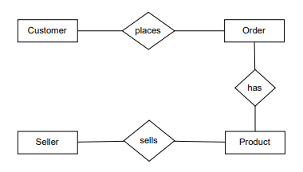
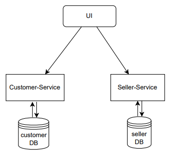
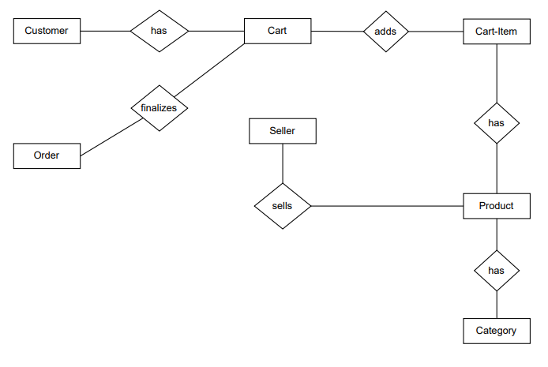
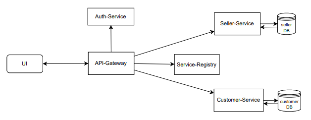

# Crafts Of Ceylon

A web application that was designed to bridge the gap between local Sri Lankan artisans and their customers.

## Functionality

Allows artisans to showcase their products and allow customers to purchanse their handcrafts online.

## Technology

- FRONT-END - React.
- BACK-END - Spring Boot.
- Database - MySQL.

|  |  |  |
|---|---|---|

## Initial Plan & Development

Initially I was responsible for developing the **FRONT-END** Only.
| Group Members | Role | Link |
| ------ | ------ | ------ |
| Bilal Azwar | FRONT-END | [Craft-Of-Ceylon front-end](https://github.com/BilalHamza7/Crafts-Of-Ceylonzip) |
| Saabique Sahdoon | UI/UX Design |  [Figma mockup](https://www.figma.com/proto/3XGoe4E6nEse1CcRyfJTtH?node-id=0-1&t=d1QZR89nw2pySWlF-6)|
| Bilal Hamza | BACK-END |  [customer-service](https://github.com/BilalHamza7/customer), [seller-service](https://github.com/BilalHamza7/employee)|

## Improvements-Back-End

After the initial development and the submission of the project, I identified some areas for improvement in the BACK-END and did the changes.

## Previous-Back-End
These are the initial developed plans before the improvements

| ER Diagram | BACK-END Design |
|---|---|
|  |  |

## Improved-Back-End

| ER Diagram | BACK-END Design |
|---|---|
|  |  |

- Initially had only 2 back-end services.
- Added API-Gateway, Auth-Service and Service-Registry services into this microservice architecture.
- Implemented Spring Security.
- Initially didn't having mappings between entities.
- Added Swagger Api-Documentation.

